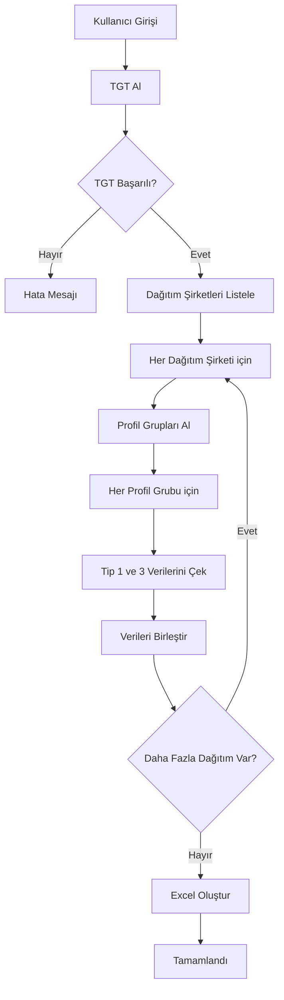

# 📊 Profil Katsayıları İndirici

EPİAŞ (Enerji Piyasaları İşletme A.Ş.) Şeffaflık Platformu'ndan profil katsayılarını otomatik olarak indiren modern bir masaüstü uygulaması.


## 📋 İçindekiler

- [Özellikler](#-özellikler)
- [Gereksinimler](#-gereksinimler)
- [Kurulum](#-kurulum)
- [Kullanım](#-kullanım)
- [EXE Dosyası Oluşturma](#-exe-dosyası-oluşturma)
- [Proje Yapısı](#-proje-yapısı)
- [Teknik Detaylar](#-teknik-detaylar)
- [Sorun Giderme](#-sorun-giderme)
- [Katkıda Bulunma](#-katkıda-bulunma)
- [Lisans](#-lisans)
- [İletişim](#-iletişim)

## ✨ Özellikler

- 🎨 **Modern ve Kullanıcı Dostu Arayüz**: CustomTkinter ile tasarlanmış şık, koyu tema destekli GUI
- 🔐 **Güvenli Kimlik Doğrulama**: EPİAŞ CAS (Central Authentication Service) entegrasyonu
- 📅 **Esnek Tarih Seçimi**: Yıl, ay ve gün için ayrı kontroller ile kolay dönem seçimi
- 📂 **Özelleştirilebilir Çıktı**: İstediğiniz klasöre kaydetme seçeneği
- 📊 **Excel Çıktısı**: Tüm profil katsayılarını düzenli Excel formatında kaydetme
- ⚡ **Asenkron İşlem**: Arkaplan işleme ile donmayan arayüz
- 📈 **İlerleme Takibi**: Gerçek zamanlı ilerleme çubuğu ve detaylı log sistemi
- 🔍 **Kapsamlı Veri Çekimi**:
  - Tüm dağıtım şirketleri
  - Her bir profil grubu
  - Her iki sayaç okuma tipi (Tip 1 ve Tip 3)
- 📧 **İletişim ve Destek**: Uygulama içi iletişim modülü
- 🌐 **Açık Kaynak**: GitHub üzerinden erişilebilir kaynak kodları

## 🔧 Gereksinimler

### Python Sürümü

- Python 3.8 veya üzeri

### Bağımlılıklar

```txt
customtkinter>=5.0.0
requests>=2.28.0
pandas>=1.5.0
openpyxl>=3.0.0
```

### EPİAŞ Hesabı

Bu uygulamayı kullanabilmek için aktif bir [EPİAŞ Şeffaflık Platformu](https://seffaflik.epias.com.tr/) hesabına ihtiyacınız vardır.

## 📥 Kurulum

### 1. Python Kurulumu

Eğer Python yüklü değilse, [Python'un resmi web sitesinden](https://www.python.org/downloads/) indirip kurun.

> **Not**: Kurulum sırasında "Add Python to PATH" seçeneğini işaretlemeyi unutmayın!

### 2. Projeyi İndirme

```bash
git clone https://github.com/demirbas1436/profil-katsayilari.git
cd profil-katsayilari/gui
```

veya

ZIP dosyası olarak indirip çıkarın.

### 3. Bağımlılıkları Yükleme

Terminal/Komut İstemi'nde proje klasöründe:

```bash
pip install -r requirements.txt
```

veya bağımlılıkları tek tek yükleyin:

```bash
pip install customtkinter requests pandas openpyxl
```

## 🚀 Kullanım

### Uygulamayı Başlatma

```bash
python profil_katsayilari_gui.py
```

### Adım Adım Kullanım

1. **Giriş Bilgileri**: EPİAŞ kullanıcı adınızı ve şifrenizi girin
2. **Dönem Seçimi**: İstediğiniz yıl, ay ve günü seçin
3. **Klasör Seçimi** (İsteğe bağlı): "Klasör Seç" butonuna tıklayarak çıktı konumunu belirleyin
4. **İndirme**: "Verileri İndir ve Excel Oluştur" butonuna tıklayın
5. **Bekleyin**: İşlem kütüğünden ilerlemeyi takip edin
6. **Tamamlandı**: Excel dosyası belirttiğiniz konuma kaydedilecektir

### Çıktı Dosyası

Uygulama `Tum_Profil_Katsayilari.xlsx` adında bir Excel dosyası oluşturur ve aşağıdaki sütunları içerir:

| Sütun Adı | Açıklama |
|-----------|----------|
| DONEM | Seçilen dönem (ISO 8601 formatında) |
| Organizasyon ID | Dağıtım şirketinin ID'si |
| Organizasyon Adı | Dağıtım şirketinin adı |
| Profil Grup ID | Profil grubunun ID'si |
| Profil Grup Adı | Profil grubunun adı |
| Sayaç Tipi | Sayaç okuma tipi (1 veya 3) |
| Zaman | Veri zamanı |
| Çarpan | Profil katsayısı değeri |

## 📦 EXE Dosyası Oluşturma

Uygulamayı Python yüklü olmayan bilgisayarlarda da çalıştırabilmek için tek bir `.exe` dosyası oluşturabilirsiniz.

### 1. PyInstaller Kurulumu

```bash
pip install pyinstaller
```

### 2. EXE Oluşturma

Proje klasöründe terminal/komut isteminde aşağıdaki komutu çalıştırın:

```bash
pyinstaller --noconfirm --onefile --windowed --icon "icon.ico" --version-file "file_version_info.txt" --add-data "fetch_all_multiple_factors.py;." "profil_katsayilari_gui.py"
```

### 3. Komut Parametreleri Açıklaması

| Parametre | Açıklama |
|-----------|----------|
| `--noconfirm` | Eski dosyaları sormadan üzerine yazar |
| `--onefile` | Tek bir .exe dosyası oluşturur |
| `--windowed` | Konsol penceresi açmadan çalışır (GUI uygulamaları için) |
| `--icon "icon.ico"` | Uygulamanın simgesini belirler |
| `--version-file "file_version_info.txt"` | Dosya sürüm bilgilerini ekler |
| `--add-data "fetch_all_multiple_factors.py;."` | Backend dosyasını EXE'ye dahil eder |

### 4. EXE Dosyasının Konumu

Komut başarıyla tamamlandığında:

```
dist/
  └── profil_katsayilari_gui.exe  ← Bu dosyayı paylaşabilirsiniz
```

`dist` klasöründeki `.exe` dosyasını istediğiniz yere kopyalayabilir veya başkalarıyla paylaşabilirsiniz.

### 5. Önemli Notlar

> ⚠️ **DİKKAT**: `icon.ico` dosyasının proje klasöründe olduğundan emin olun!

> 💡 **İPUCU**: İlk çalıştırmada Windows Defender uyarısı verebilir. "Daha fazla bilgi" → "Yine de çalıştır" seçeneklerini kullanabilirsiniz.

> 📝 **NOT**: EXE dosyası yaklaşık 150-200 MB boyutunda olabilir çünkü tüm Python kütüphanelerini içerir.

## 📁 Proje Yapısı

```
gui/
│
├── profil_katsayilari_gui.py      # Ana GUI uygulaması
├── fetch_all_multiple_factors.py  # Backend API işlemleri
├── file_version_info.txt          # EXE sürüm bilgileri
├── icon.ico                        # Uygulama ikonu
├── requirements.txt                # Python bağımlılıkları
├── profil_katsayilari_gui.spec    # PyInstaller yapılandırması
└── README.md                       # Bu dosya
```

## 🔍 Teknik Detaylar

### API Entegrasyonları

Uygulama EPİAŞ Şeffaflık Platformu'nun aşağıdaki API endpoint'lerini kullanır:

1. **Kimlik Doğrulama**:
   - `POST https://giris.epias.com.tr/cas/v1/tickets`

2. **Dağıtım Şirketleri**:
   - `POST /v1/consumption/data/multiple-factor-distribution`

3. **Profil Grupları**:
   - `POST /v1/consumption/data/multiple-factor-profile-group`

4. **Profil Katsayıları**:
   - `POST /v1/consumption/data/multiple-factor`

### Veri Akışı



### Kullanılan Teknolojiler

- **GUI Framework**: [CustomTkinter](https://github.com/TomSchimansky/CustomTkinter)
- **HTTP İstemci**: [Requests](https://requests.readthedocs.io/)
- **Veri İşleme**: [Pandas](https://pandas.pydata.org/)
- **Excel Yazma**: [OpenPyXL](https://openpyxl.readthedocs.io/)
- **EXE Oluşturma**: [PyInstaller](https://www.pyinstaller.org/)

## 🐛 Sorun Giderme

### "ModuleNotFoundError" Hatası

```bash
pip install -r requirements.txt
```

### "Giriş başarısız" Hatası

- EPİAŞ kullanıcı adı ve şifrenizi kontrol edin
- İnternet bağlantınızı kontrol edin
- EPİAŞ Şeffaflık Platformu'nun erişilebilir olduğunu doğrulayın

### "Excel kaydetme hatası"

- Seçilen klasörün yazma izinlerini kontrol edin
- Aynı isimde açık bir Excel dosyası varsa kapatın
- Yeterli disk alanı olduğundan emin olun

### EXE Çalışmıyor

- Windows Defender/Antivirüs yazılımını kontrol edin
- `icon.ico` dosyasının aynı klasörde olduğundan emin olun
- Yönetici olarak çalıştırmayı deneyin

### İşlem Çok Yavaş

Bu normaldir! Uygulama:

- Tüm dağıtım şirketlerini tarar
- Her dağıtım şirketinin tüm profil gruplarını alır
- Her profil grubu için 2 farklı sayaç tipinde veri çeker

Bir dönem için tam tarama **5-15 dakika** sürebilir.

## 🤝 Katkıda Bulunma

Katkılarınızı bekliyoruz! İşte nasıl katkıda bulunabilirsiniz:

1. Bu depoyu fork edin
2. Yeni bir özellik dalı oluşturun (`git checkout -b yeni-ozellik`)
3. Değişikliklerinizi commit edin (`git commit -am 'Yeni özellik eklendi'`)
4. Dalınıza push yapın (`git push origin yeni-ozellik`)
5. Pull Request oluşturun

### Geliştirme Fikirleri

- [ ] Çoklu dönem seçimi ve karşılaştırma
- [ ] Grafik/Chart görselleştirme eklentisi
- [ ] Veri filtreleme seçenekleri
- [ ] CSV çıktı desteği
- [ ] Otomatik güncelleme kontrolü
- [ ] Multi-threading ile daha hızlı veri çekme

## 📄 Lisans

Bu proje MIT Lisansı altında lisanslanmıştır. Detaylar için [LICENSE](LICENSE) dosyasına bakın.

```
MIT License

Copyright (c) 2026 Murat Demirbaş

Permission is hereby granted, free of charge, to any person obtaining a copy
of this software and associated documentation files (the "Software"), to deal
in the Software without restriction, including without limitation the rights
to use, copy, modify, merge, publish, distribute, sublicense, and/or sell
copies of the Software, and to permit persons to whom the Software is
furnished to do so, subject to the following conditions:

The above copyright notice and this permission notice shall be included in all
copies or substantial portions of the Software.

THE SOFTWARE IS PROVIDED "AS IS", WITHOUT WARRANTY OF ANY KIND, EXPRESS OR
IMPLIED, INCLUDING BUT NOT LIMITED TO THE WARRANTIES OF MERCHANTABILITY,
FITNESS FOR A PARTICULAR PURPOSE AND NONINFRINGEMENT. IN NO EVENT SHALL THE
AUTHORS OR COPYRIGHT HOLDERS BE LIABLE FOR ANY CLAIM, DAMAGES OR OTHER
LIABILITY, WHETHER IN AN ACTION OF CONTRACT, TORT OR OTHERWISE, ARISING FROM,
OUT OF OR IN CONNECTION WITH THE SOFTWARE OR THE USE OR OTHER DEALINGS IN THE
SOFTWARE.
```

## 📧 İletişim

**Murat Demirbaş**

- 📧 E-posta: [demirbas1436@gmail.com](mailto:demirbas1436@gmail.com)
- 📱 Telefon: 05365689025
- 💼 LinkedIn: [linkedin.com/in/muratdemirbas1436](https://tr.linkedin.com/in/muratdemirbas1436)
- ⭐ GitHub: [github.com/demirbas1436](https://github.com/demirbas1436)

---

## 🙏 Teşekkürler

Bu uygulamayı kullandığınız için teşekkür ederiz! Herhangi bir sorun, öneri veya geri bildiriminiz için lütfen bizimle iletişime geçin.

**Faydalı olması dileğiyle!** 💙

---

<div align="center">
  Made with ❤️ by Murat Demirbaş
  <br>
  <sub>Enerji sektörü için açık kaynak çözümler</sub>
</div>
